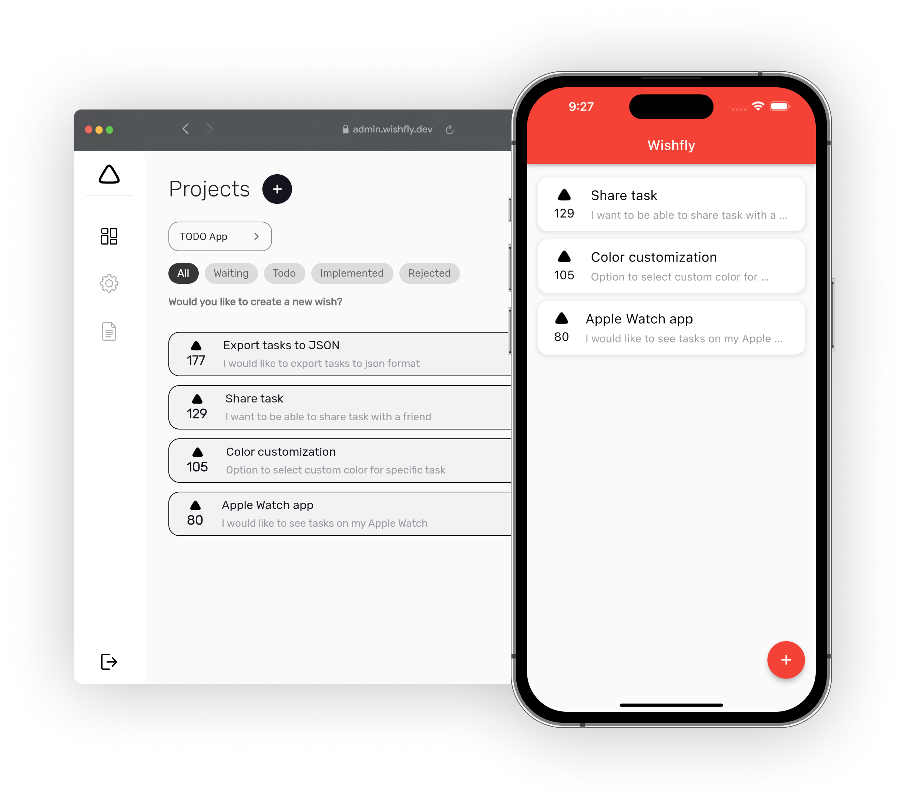

# Wishfly

[](https://pub.dev/packages/wishfly)
[](https://wishfly.dev/)

## Put your users to driver's seat. Wishfly allows you to know what functions should your app have. 




## Features
- User can create wish with title and description. 
- In [Admin](https://admin.wishfly.dev) you can change status of each wish (all new wishes must be approved before showing in list for users).

## Getting started
> 🤘 It takes less than 180 seconds to integrate Wishfly into your app.<br />

1. Go to the [Wishfly Admin](https://admin.wishfly.dev) and create account. <br />Click on plus button to create a new project and enter your app's name.

2. Add dependency to your `pubspec.yaml` file

```bash
$ flutter pub add wishfly: ^0.0.5
```
or 

```yaml
dependencies:
  flutter:
    sdk: flutter
  ...
  wishfly: ^0.0.4
```

Don't forget to `flutter pub get`.

3. Import package in your dart file

```dart
import 'package:wishfly/wishfly.dart';
```

4. You can place Widget in you widget tree. It could be a screen, modal or whatever you want. You can see example below.

```dart
import 'package:wishfly/wiredash.dart';

class MyApp extends StatelessWidget {

  @override
  Widget build(BuildContext context) {
    return Wiredash(
      apiKey: "your-api-key-here", // your API key
      projectId: 0, // your project ID
    );
  }
}
```
---

## Additional information

### Localization
Default language is English.

For supporting other languages, you can add corresponding keys to your own localization file and pass it to Wishfly widget. You can see localization keys [here](https://github.com/Wishfly-dev/client/blob/dev/assets/l10n/en.json).

To get localization, add ```WishflyLocalizationDelegate``` to your MaterialApp widget. 

```dart
class MyApp extends StatelessWidget {
  const MyApp({super.key});

  @override
  Widget build(BuildContext context) {
    return MaterialApp(
      title: 'Wishfly Demo',
      supportedLocales: const [Locale('en')],
      localizationsDelegates: const [
        GlobalMaterialLocalizations.delegate,
        GlobalWidgetsLocalizations.delegate,
        GlobalCupertinoLocalizations.delegate,
        WishflyLocalizationsDelegate(), // Add this line
      ],
      home: ...,
    );
  }
}
```

If you do not add keys to your localization file, you can pass a map with keys to Wishfly widget in order to override default values.

```dart
child: Wishfly(
    apiKey: ...
    projectId: ...,
    localizationOverrides: const {
        "noWishes": "No wishes here, but you can be the first one!",
        //... and more
    },
),
```

### Theme 
You can customize colors in UI. Here you can see what you can customize:

```dart
class WishflyThemeData {
  final Brightness brightness;
  final Color? voteIconColor;
  final Color? addWishButtonColor;
  final Color? titleTextColor;
  final Color? tileBackgroundColor;
  final Color? descriptionTextColor;
  final Color? shadowColor;
  final Color? voteCountTextColor;
  final Color? primaryBackgroundColor;
  final Color? itemTileColor;
  final Color? progressBarBackgroundColor;

  //...
}
```

In order to support dark or light mode, use ```WishflyThemeData.light()``` or ```WishflyThemeData.dark()``` factory method. 

Example usage could be: 

```dart
child: Wishfly(
    apiKey: "your-api-key-here", // Paste your API key here
    projectId: 0, // Paste your project ID here        
    theme: WishflyThemeData.light(
        voteIconColor: Colors.black,
        addWishButtonColor: Colors.black,
        // more..
    ),      
),
``` 

--- 
### Note: ⚠️ Wishfly is currently in beta and under development. The SDK API might change in future.